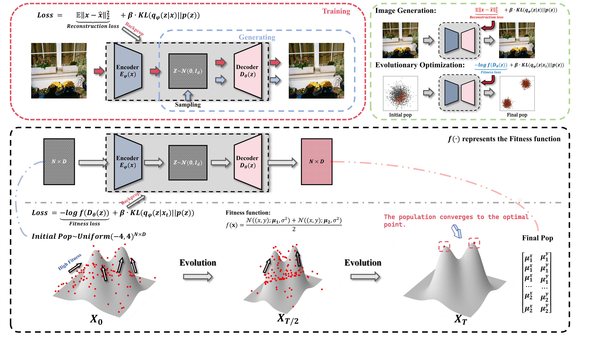

## Can Evolution Be Learned as a Generative Process?
### A Variational Framework for Fitness-Guided Optimization

[](https://opensource.org/licenses/MIT)
[](https://www.python.org/)

**VAE Evolution** - Official PyTorch Implementation
> 📄 **Paper Status**: A manuscript describing this work is in preparation and will be submitted soon.We will update this page with a link to the paper upon submission or publication.

> *Reinterpreting evolutionary optimization as fitness-driven variational generative process*

## Introduction
This open-source project implements an innovative optimization paradigm: reinterpreting evolutionary computation as a fitness-signal-driven variational generative process. Inspired by Variational Autoencoders (VAEs), we establish a unified theoretical framework integrating evolutionary optimization and generative modeling, proposing a series of neural network-based learnable optimizers.

[](@replace=1)

**Core Methodology**:
Evolutionary processes are formulated as approximate inference of high-fitness solution distribution: p(x) ∝ g(f(x))
where the fitness function f(x) guides the generative distribution toward optimal regions.


## Model Variants

Our framework formulates optimization as a generative modeling problem grounded in the variational autoencoder (VAE) architecture. By interpreting the fitness function as an unnormalized likelihood signal, the model learns a parametric distribution over the solution space that progressively concentrates probability mass around high-fitness regions. To accommodate diverse optimization scenarios, we introduce five specialized model variants, each tailored to a distinct class of problems.

####  **VAE** :*The benchmark variant of unconstrained single-peak optimization*
####  **VQVAE**: *Employs a discrete autoencoder to handle multi-peak optimization.*
####  **MH-VQVAE** :*Employing multiple head encoders to better capture the multi-peak optimization.*
####  **ConsVAE** :*Integrates constraints via the augmented Lagrangian method with adaptive penalties.*  
####  **MOE** :*Multi-Objective Encoder for Pareto Front Approximation*  

> **Note**: All variants adhere to a unified principle—recasting evolutionary search as fitness-guided distributional learning—differing only in latent space design, constraint handling mechanisms, or multi-objective strategies.


## Installation

### Using pip
```bash
pip install -r requirements.txt
```


## Quick Start
```python
import torch
from model.VAEs import MHVQVAE
from scripts.train_muti_peak import train
from probfun.fitness import two_peak_density as fitness_function

input_dim = 2
batch_size = 512
epochs = 30
learning_rate = 0.001
num_embeddings = 32
embedding_dim = 16


model = MHVQVAE(input_dim, num_embeddings, embedding_dim , n_heads=2)


model , loss_trace = train(model=model, device="cpu", input_dim=input_dim, batch_size=batch_size, fitness_function=fitness_function,
                           epochs=epochs,learning_rate =learning_rate, mapping_type="sigmoid",
                           objective = "maximize",
                           )


with torch.no_grad():
    z = torch.randn(10000, input_dim)
    x0_pred,_ = model(z)


print(x0_pred[1])

print(x0_pred[0])
```

## Project Structure
```
vae_evo/
├── examples/     # Usage examples
├── model/        # Model definitions
├── probfun/      # Probability functions
├── scripts/      # Utility scripts
├── utils/        # Helper functions
└── requirements.txt
```


## 📄 License

This project is licensed under the MIT License - see the [LICENSE](LICENSE) file for details.

## ➕Citation


If you use this work, please cite our preprint:

```bibtex
@article{chai2026can,
  title={Can Evolution Be Learned as a Generative Process?},
  author={Chai, Jinhao and Chen, Guanda and Shen, Jingfang},
  journal={TechRxiv},
  year={2026},
  doi={10.36227/techrxiv.177041645.58906907/v1}  
}
